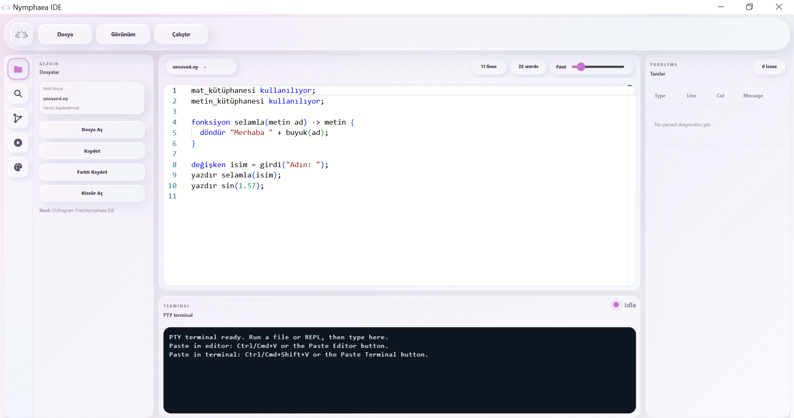
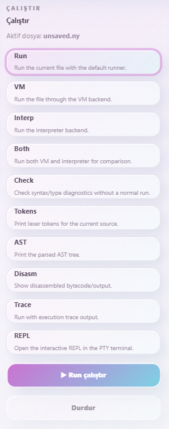
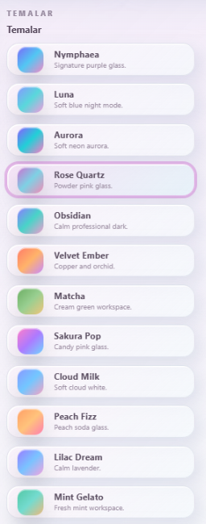
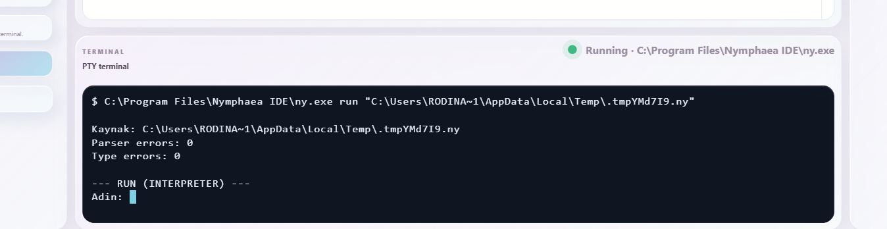
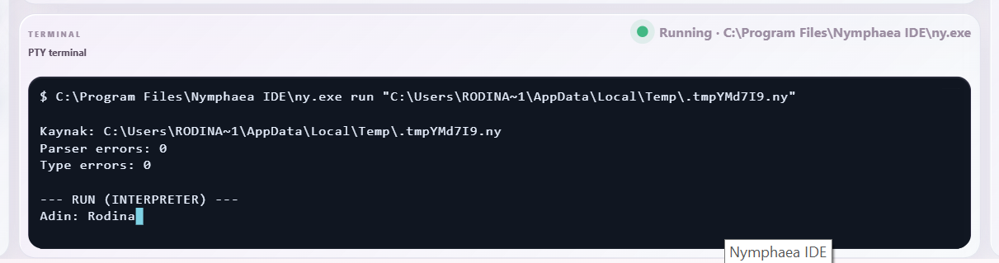
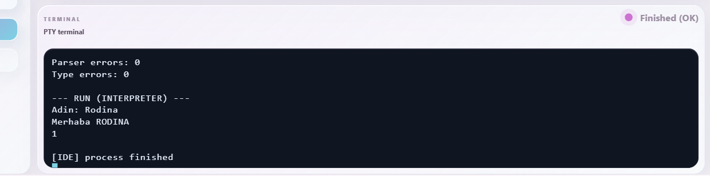
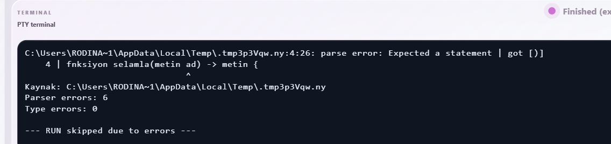

# Nymphaea IDE

<p align="center">
  
</p>

<p align="center">
  <strong>Nymphaea programlama dili için Tauri, React, TypeScript, Monaco Editor ve yerleşik terminal ile geliştirilen modern masaüstü IDE.</strong>
</p>

<p align="center">
  
  
  
  
  
  
</p>

---

## İçindekiler

- [Özet](#özet)
- [Ekran Görüntüleri](#ekran-görüntüleri)
- [İndirme ve Kurulum](#indirme-ve-kurulum)
- [Temel Özellikler](#temel-özellikler)
- [İlk Kullanım](#ilk-kullanım)
- [Nymphaea Dili ile İlişki](#nymphaea-dili-ile-ilişki)
- [Çalıştırma Modları](#çalıştırma-modları)
- [Tema Sistemi](#tema-sistemi)
- [Tanılar Paneli](#tanılar-paneli)
- [Geliştirici Kurulumu](#geliştirici-kurulumu)
- [Dağıtım Paketi Oluşturma](#dağıtım-paketi-oluşturma)
- [Proje Yapısı](#proje-yapısı)
- [Akademik ve Teknik Değer](#akademik-ve-teknik-değer)
- [Yol Haritası](#yol-haritası)
- [Lisans](#lisans)

---

## Özet

**Nymphaea IDE**, Türkçe sözdizimine odaklanan **Nymphaea** programlama dili için geliştirilen masaüstü geliştirme ortamıdır. Uygulama; kaynak kod yazımı, dosya yönetimi, farklı çalışma modları, yerleşik terminal, tema sistemi ve hata tanılama görünümü gibi temel IDE bileşenlerini tek bir arayüzde birleştirir.

Bu proje, modern masaüstü uygulama geliştirme yaklaşımı ile programlama dili araç zincirini bir araya getirir. Arayüz tarafında **React** ve **TypeScript**, masaüstü paketleme tarafında **Tauri**, editör deneyiminde **Monaco Editor**, terminal deneyiminde ise PTY tabanlı çalışma mantığı kullanılır.

Nymphaea IDE yalnızca görsel bir editör değildir; Nymphaea çalışma zamanını kullanarak `.ny` dosyalarını çalıştırmayı, çıktıları terminalde göstermeyi ve hata çıktılarının IDE içinde incelenebilmesini hedefleyen bütünleşik bir geliştirme ortamıdır.

---

## Ekran Görüntüleri

### Ana arayüz



### Çalıştırma paneli



### Tema paneli



### Yerleşik terminal



### Etkileşimli giriş



### Program çıktısı



### Hata çıktısı örneği



---

## İndirme ve Kurulum

Nymphaea IDE, Windows kullanıcıları için hazır kurulum paketleriyle yayımlanır. En güncel sürüm GitHub **Releases** sayfasından indirilebilir.

<p align="center">
  <a href="https://github.com/RodinaAmrMukhtar/nymphaea-ide/blob/main/releases/latest/download/Nymphaea_IDE_1.0.0_x64-setup.exe">
    
  </a>
  <a href="https://github.com/RodinaAmrMukhtar/nymphaea-ide/blob/main/releases/latest/download/Nymphaea_IDE_1.0.0_x64_en-US.msi">
    
  </a>
</p>

| Paket | Açıklama | Dosya adı |
|---|---|---|
| Windows Setup `.exe` | Kurulum sihirbazı ile önerilen standart kurulum paketi | `Nymphaea_IDE_1.0.0_x64-setup.exe` |
| Windows MSI `.msi` | MSI tabanlı Windows kurulum paketi | `Nymphaea_IDE_1.0.0_x64_en-US.msi` |

Kurulum adımları:

1. Yukarıdaki indirme düğmelerinden birini kullanarak kurulum dosyasını indirin.
2. İndirilen `.exe` veya `.msi` dosyasını çalıştırın.
3. Kurulum adımlarını tamamlayın.
4. Başlat menüsünden **Nymphaea IDE** uygulamasını açın.

---

## Temel Özellikler

| Özellik | Açıklama |
|---|---|
| Monaco Editor | Kod yazımı için gelişmiş editör deneyimi sağlar. |
| Yerleşik terminal | Nymphaea çalışma zamanının çıktıları uygulama içinde görüntülenir. |
| Dosya işlemleri | Dosya açma, kaydetme, farklı kaydetme ve klasör seçme desteği sunar. |
| Çalıştırma modları | Run, VM, Interp, Both, Check, Tokens, AST, Disasm, Trace ve REPL modlarını destekler. |
| Tema sistemi | Açık ve koyu temalar arasında geçiş yapılabilir. |
| Tanılar paneli | Hata çıktılarının satır, sütun ve mesaj bilgisiyle izlenmesini hedefler. |
| Windows dağıtımı | `.exe` ve `.msi` kurulum paketleri oluşturulabilir. |
| Nymphaea entegrasyonu | IDE, Nymphaea çalışma zamanını masaüstü arayüz ile bütünleştirir. |

---

## İlk Kullanım

Uygulama açıldığında örnek bir `.ny` programı ile editör hazır gelir.

```ny
mat_kütüphanesi kullanılıyor;
metin_kütüphanesi kullanılıyor;

fonksiyon selamla(metin ad) -> metin {
  döndür "Merhaba " + buyuk(ad);
}

değişken isim = girdi("Adın: ");
yazdır selamla(isim);
yazdır sin(1.57);
```

Programı çalıştırmak için:

1. Sol menüden **Çalıştır** sekmesini açın.
2. Uygun çalıştırma modunu seçin.
3. **Run çalıştır** düğmesine basın.
4. Program çıktısını alt terminal panelinden takip edin.

---

## Nymphaea Dili ile İlişki

Nymphaea IDE, Nymphaea programlama dili için tasarlanmış bir geliştirme ortamıdır. Dil çekirdeği; yorumlayıcı, bayt kod sanal makinesi, tip denetleyicisi ve komut satırı araçlarından oluşur.

IDE tarafı, bu çalışma zamanını kullanıcı dostu bir masaüstü arayüz ile birleştirir. Böylece kullanıcılar `.ny` dosyalarını yalnızca komut satırından değil, görsel bir geliştirme ortamı üzerinden de yazabilir, çalıştırabilir ve inceleyebilir.

| Bileşen | Ad |
|---|---|
| Programlama dili | Nymphaea |
| Masaüstü IDE | Nymphaea IDE |
| Dosya uzantısı | `.ny` |
| Kısa çalışma zamanı komutu | `ny` |
| Uzun çalışma zamanı komutu | `nymphaea` |

---

## Çalıştırma Modları

| Mod | Açıklama |
|---|---|
| Run | Varsayılan çalıştırma modudur. |
| VM | Programı bayt kod sanal makinesi üzerinde çalıştırır. |
| Interp | Programı yorumlayıcı arka uç ile çalıştırır. |
| Both | Yorumlayıcı ve VM sonuçlarını karşılaştırmak için kullanılır. |
| Check | Programı çalıştırmadan sözdizimi ve tip denetimi yapar. |
| Tokens | Kaynak koddan üretilen tokenları gösterir. |
| AST | Ayrıştırılmış soyut sözdizim ağacını gösterir. |
| Disasm | Üretilen bayt kod veya ara çıktıyı gösterir. |
| Trace | Yürütme izleme çıktısı üretir. |
| REPL | Etkileşimli çalışma modunu açar. |

---

## Tema Sistemi

Nymphaea IDE, farklı çalışma ortamlarına uygun açık ve koyu temalar içerir. Tema sistemi, arayüz bileşenlerinin tamamını CSS değişkenleri üzerinden güncelleyerek tutarlı bir görünüm sağlar.

Tema sistemi aşağıdaki bölümleri kapsar:

- Üst menü,
- Sol gezinme paneli,
- Editör çerçevesi,
- Terminal paneli,
- Tanılar paneli,
- Butonlar ve kart bileşenleri,
- Tema seçim ekranı.

---

## Tanılar Paneli

Tanılar paneli, Nymphaea çalışma zamanından gelen hata çıktılarının IDE içinde incelenmesini hedefler. Bu yapı, hata mesajlarının yalnızca terminalde görünmesi yerine düzenli bir tablo halinde gösterilebilmesini sağlar.

Örnek hata biçimi:

```text
C:\Users\...\main.ny:4:26: parse error: Expected a statement
```

Tanılar panelinde gösterilmesi hedeflenen bilgiler:

| Alan | Açıklama |
|---|---|
| Type | Hata türü |
| Line | Satır numarası |
| Col | Sütun numarası |
| Message | Hata açıklaması |

---

## Geliştirici Kurulumu

Kaynak koddan çalıştırmak için aşağıdaki araçlar gereklidir:

- Node.js,
- npm,
- Rust ve Cargo,
- Tauri için gerekli Windows geliştirme araçları,
- Nymphaea çalışma zamanı ikilisi.

Bağımlılıkları kurmak için:

```bash
npm install
```

Geliştirme modunda çalıştırmak için:

```bash
npm run tauri:dev
```

Web arayüzünü ayrı derlemek için:

```bash
npm run build
```

---

## Dağıtım Paketi Oluşturma

Windows için kurulum paketi oluşturmak amacıyla:

```bash
npm run tauri build
```

Derleme tamamlandığında çıktı dosyaları genellikle aşağıdaki klasörlerde oluşur:

```text
src-tauri/target/release/bundle/msi/
src-tauri/target/release/bundle/nsis/
```

Bu çıktılar GitHub Releases bölümüne yüklenerek son kullanıcıların uygulamayı kolayca indirmesi sağlanabilir.

---

## Proje Yapısı

```text
nymphaea-ide/
├─ src/
│  ├─ App.tsx
│  ├─ styles.css
│  ├─ nyLanguage.ts
│  └─ assets/
├─ src-tauri/
│  ├─ src/
│  │  ├─ main.rs
│  │  └─ lib.rs
│  ├─ binaries/
│  ├─ icons/
│  └─ tauri.conf.json
├─ docs/
│  └─ assets/
├─ package.json
├─ README.md
└─ LICENSE
```

---

## Akademik ve Teknik Değer

Nymphaea IDE, bilgisayar mühendisliği ve yazılım geliştirme açısından aşağıdaki konuları bir araya getiren kapsamlı bir uygulama örneğidir:

- Masaüstü uygulama geliştirme,
- Tauri tabanlı paketleme,
- React ve TypeScript ile arayüz tasarımı,
- Monaco Editor entegrasyonu,
- PTY terminal yönetimi,
- Programlama dili çalışma zamanı entegrasyonu,
- IDE tasarım prensipleri,
- Hata tanılama arayüzleri,
- Windows kurulum paketi oluşturma,
- Açık kaynak proje dokümantasyonu.

---

## Lisans

Bu proje akademik amaçlı olarak geliştirilmiştir. Kullanım ve geliştirme süreçlerinde kaynak gösterilmesi önerilir.
